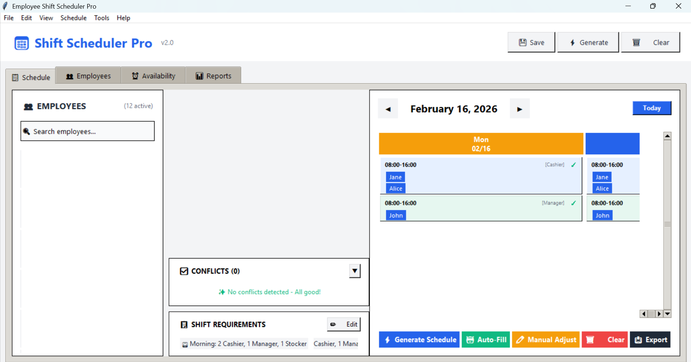
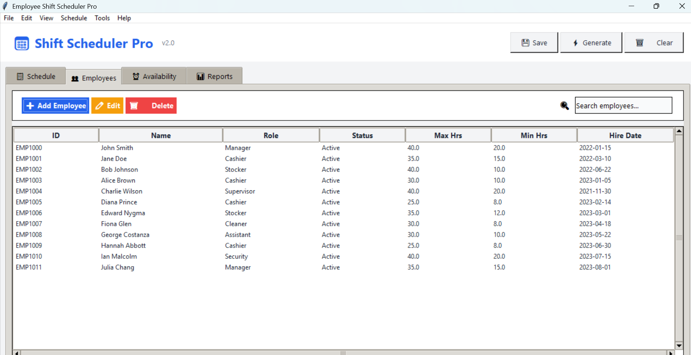
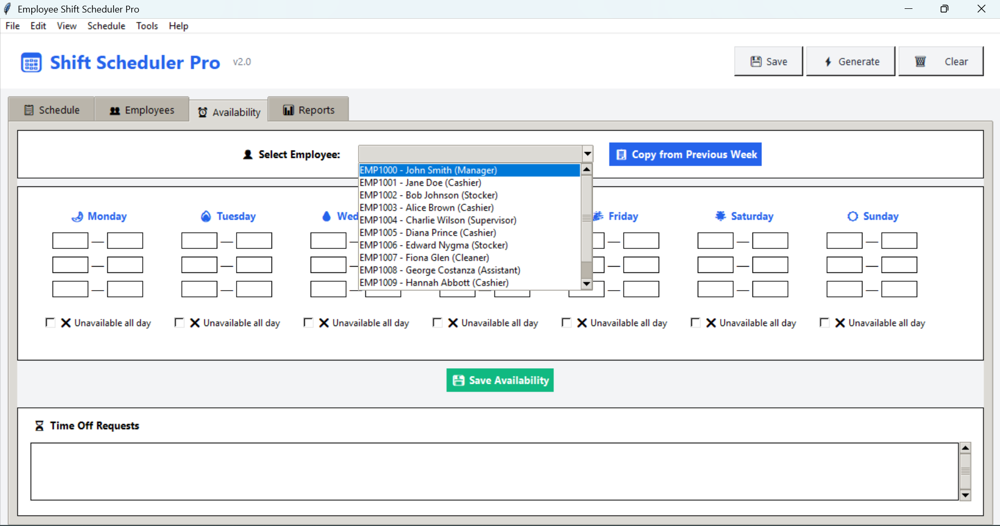
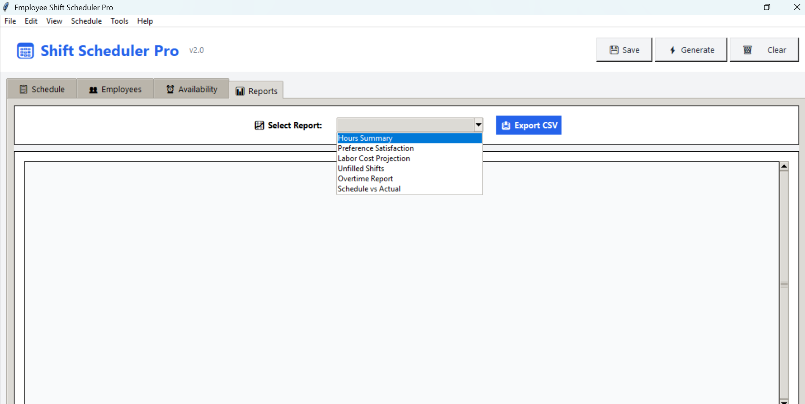

# Employee Shift Scheduler App

---

## What Is This App?

Employee Shift Scheduler is a desktop program that helps managers create weekly work schedules for employees.

It runs on your computer.  
It does not need internet.

This app makes scheduling faster and helps avoid mistakes like:

- Scheduling someone when they are not available  
- Giving too many hours  
- Leaving shifts empty  

---

## Who Is This For?

- Small business owners  
- Restaurant managers  
- Retail store managers  
- Anyone who creates employee schedules  
- Students learning programming  

---

## Main Features

### 1. Employees Tab

You can:

- Add new employees  
- Edit employee details  
- Delete employees  
- Search employees  
- View all employees in a table  

You can store:

- Name and ID  
- Job role (Manager, Cashier, etc.)  
- Max hours per week  
- Min hours per week  
- Hire date  
- Active or inactive status  
- Notes  

---

### 2. Availability Tab

You can:

- Choose an employee  
- Set when they can work each day  
- Add multiple time slots per day  
- Mark full days as unavailable  
- Add time off requests  
- Approve or deny time off  

---

### 3. Schedule Tab (Main Screen)

You can see:

- A weekly calendar (Monday to Sunday)  
- All employees listed  
- Shifts shown in colored boxes  
- Total hours per employee  

You can:

- Move between weeks  
- Go to the current week  
- Generate a schedule automatically  
- Auto-fill empty shifts  
- Manually adjust shifts (drag and drop)  
- Clear the schedule  
- Export schedule as CSV  

---

### 4. Reports Tab

You can view:

- Hours summary  
- Labor cost  
- Overtime report  
- Unfilled shifts  
- Preference satisfaction  
- Schedule vs actual hours  

---

## Smart Scheduling

The app:

- Checks employee availability  
- Respects maximum and minimum hours  
- Tries to be fair  
- Matches shift preferences  
- Detects conflicts  

Scheduling modes:

- Fair distribution  
- Preference first  
- Seniority based  
- Hybrid (recommended)  

---

## Conflict Detection

The app shows warnings if:

- An employee is not available  
- Someone works too many hours  
- Someone has too few hours  
- No rest between shifts  
- Double booking  
- Missing required roles  
- Not enough workers for a shift  

Problems appear in the warning panel at the bottom.

---

## Manual Mode

When manual mode is on:

- Drag and drop employees  
- Right-click to remove  
- Click empty slots to assign  
- Changes save automatically  

---

## Keyboard Shortcuts

- **Ctrl + S** — Save  
- **Ctrl + O** — Open  
- **Ctrl + Z** — Undo  
- **Ctrl + Y** — Redo  
- **Ctrl + N** — New employee  
- **Delete** — Delete selected  
- **Esc** — Exit manual mode  

---

## Saving Data

- Data is saved in `schedule_data.json`  
- Auto-save after changes  
- Manual save available  
- Can load previous files  
- Export schedules as CSV  

---

## Getting Started

1. Add employees  
2. Set availability  
3. Set shift requirements  
4. Go to Schedule tab  
5. Click **Generate Schedule**  
6. Fix any conflicts  
7. Export or print  

---

# More App Screenshots
##Employee tab

##Availability tab

##Reports tab

